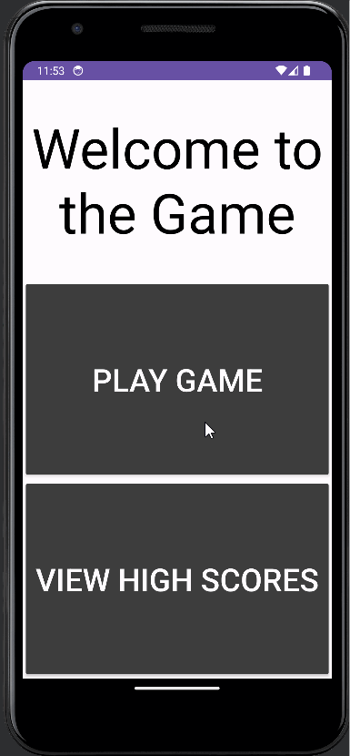

# Midterm Project

This is a guessing game made in Android Studio with Kotlin. Guess the number 1-100.

## Functionality 

The following **required** functionality is completed:

* [ ] User can open screen to see option to play or view high scores.
* [ ] User can click play button to start the game.
* [ ] User can type numbered guess and submit.
* [ ] User can win.

The following **extensions** are implemented:

* User can see if their guess was too high or too low.
* User can hear a sound if their guess was wrong.

## Video Walkthrough

Here's a walkthrough of implemented user stories:

GIF created with [LiceCap](http://www.cockos.com/licecap/).

## Notes

Had to work all weekend and all day today so didn't get to fully finish. No high scores are implemented sadly. I really wish I had more time.

## License

    Copyright [2023] [Tristan Dearborn]

    Licensed under the Apache License, Version 2.0 (the "License");
    you may not use this file except in compliance with the License.
    You may obtain a copy of the License at

        http://www.apache.org/licenses/LICENSE-2.0

    Unless required by applicable law or agreed to in writing, software
    distributed under the License is distributed on an "AS IS" BASIS,
    WITHOUT WARRANTIES OR CONDITIONS OF ANY KIND, either express or implied.
    See the License for the specific language governing permissions and
    limitations under the License.
